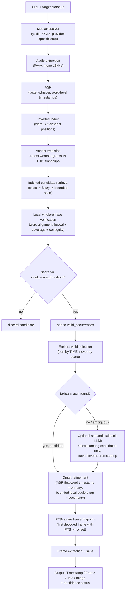
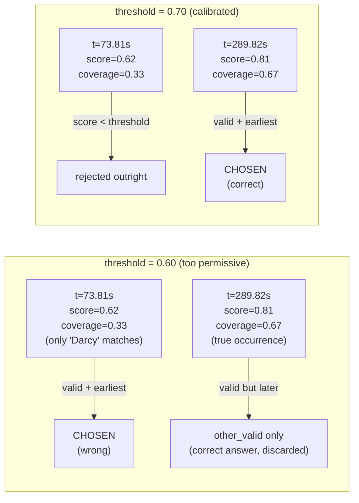
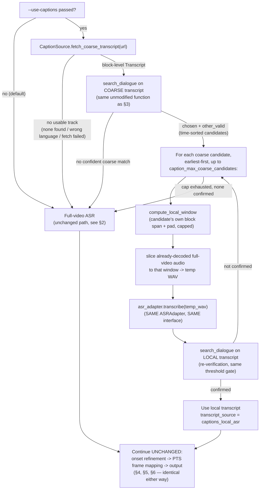

# Approach — Dialogue-to-Exact-Video-Frame Finder

This document explains the design, algorithms, assumptions, and trade-offs behind the
solution, and directly answers the evaluation questions from the Quest1 problem statement:
(3) how the solution determines where to look in the video, (4) how it determines the
relevant frame, (5) how it extracts the text, and (6) how ambiguous/uncertain results are
handled. LLM prompts (evaluation item 1) are recorded verbatim in `prompts.txt`.

## 1. Problem framing

The target dialogue is **spoken**, not necessarily displayed as on-screen text. The core
signal is therefore audio, not video/OCR. The primary problem is speech-to-video temporal
alignment: locate where in the audio the target phrase is spoken, refine that to a precise
onset, then map that onset to the video's own frame grid. No OCR or full-video visual
analysis is used anywhere in the pipeline.

## 2. End-to-end architecture

```
URL + target dialogue
  -> MediaResolver            (yt-dlp; ONLY provider-specific component)
  -> audio extraction          (PyAV, mono 16kHz)
  -> ASR                       (faster-whisper, word-level timestamps)
  -> indexed retrieval          (inverted index, rarity-ranked anchors)
  -> local verification         (word alignment, lexical+coverage+contiguity)
  -> earliest-valid selection    (by TIME, never by score)
  -> [optional semantic fallback, only if lexical retrieval was weak/ambiguous]
  -> onset refinement            (first-target-word ASR timestamp, primary;
                                   bounded local audio refinement, secondary)
  -> PTS-aware frame mapping      (first decoded frame with PTS >= onset)
  -> frame extraction + save
  -> output contract (Timestamp / Frame / Text / Image + confidence)
```

Everything after MediaResolver operates on a plain decoded media source and is identical
for every provider (see §3). Source modules: `src/dialogue_frame_finder/`.

Same pipeline, rendered as a diagram (GitHub renders this Mermaid block as an image):



## 3. How the solution determines where to look in the video (evaluation item 3)

**Provider isolation.** `media_resolver.py` is the _only_ component that knows which
platform a URL belongs to. It resolves OK.ru/YouTube/other URLs to a plain local media
file via yt-dlp, with provider-specific quirks (found empirically, not assumed) isolated
here only:

- OK.ru: the initial page fetch resets intermittently — retried with backoff (default 6
  attempts); its CDN's TLS chain isn't trusted by ffmpeg's bundled gnutls even though
  yt-dlp's own Python layer tolerates it — `-tls_verify 0` passed through to the ffmpeg
  downloader.
- YouTube: needs a JS runtime (Node) and, as of this build, `player_client=android,
web_safari` extractor args to clear a bot-check without cookies.

Everything downstream — indexing, matching, onset refinement, frame mapping — takes no
provider-specific arguments at all (enforced by
`tests/unit/test_provider_independence.py`, a structural check that these functions
cannot even see which provider produced their input).

**Indexed candidate retrieval, not brute-force scanning.** The transcript (from ASR, see
§5) is built into a lightweight in-memory inverted index (`index.py`): a dict from
normalized word to the list of transcript positions where it occurs, plus a flat
position-ordered word array. This is _not_ a database — it exists only in memory per run.

Rather than scanning the whole transcript for the target phrase, the target's own words
and short n-grams (up to trigrams) are ranked by how rare they are _within this
transcript_ (`anchors.py`) — a word appearing once is a far better search anchor than one
appearing fifty times. Retrieval (`retrieval.py`) tries the several rarest single words
(not just the single rarest anchor overall) plus the single most selective anchor overall,
and unions their index postings into candidate positions. Trying multiple unigrams, not
just the best one, matters in practice: if ASR corrupts a _different_ word in each
occurrence of the target, the single most selective anchor (often a rare n-gram) may exist
in only one of them, silently hiding the rest — this was an actual bug found and fixed
during development (`test_retrieve_candidates_recall_survives_different_word_corrupted_per_occurrence`).

**Fallback tiers**, escalated only when the previous tier finds nothing:

1. `exact_anchor` — the index lookup above.
2. `fuzzy_anchor` — approximate (edit-distance) vocabulary lookup, for when ASR corrupts
   the anchor word itself beyond exact matching (`fallback.py`).
3. `bounded_scan` — tiles the whole transcript into verification windows as a last
   resort, when no anchor (exact or fuzzy) exists anywhere.
4. `semantic_fallback` — optional, LLM-based, see §6 below.

Every result reports which tier actually produced it (`SearchResult.tier_used`) — never
silent.

**Local verification, not string equality.** Index hits are candidate _locations_, not
matches. For each, a small neighborhood around it (`neighborhood.py`, target length plus a
tolerance margin, clipped to transcript bounds) is compared against the _entire_ target
phrase via word-level alignment (`align.py`): a small dynamic-programming alignment with
free leading/trailing skips (filler words around the target cost nothing) but a real
internal gap penalty using **signed** match scores (`2*similarity - 1`), so a poor pairing
actively costs almost as much as a true gap — without this, two unrelated words could look
"free" to align rather than being correctly treated as a mismatch. This is what makes word
order matter without a separate "sequence similarity" metric: a scrambled candidate cannot
achieve a good monotonic alignment path.

`verification.py` turns that alignment into: lexical similarity (average per-word
similarity), coverage (fraction of target words actually matched above a per-word
threshold), and contiguity (how close together the matched words are in the window), then
a weighted score. A window is valid only above a configurable threshold.

**Earliest-valid selection — the target may occur more than once.** All valid windows
across the whole transcript are kept (`selection.py`), then sorted by **video time**, not
score, and the earliest wins. A later, higher-scoring occurrence is retained only as
diagnostic metadata (`SearchResult.other_valid`), feeding the ambiguity check in §6 — it
never overrides the earliest-time choice.

Why the _threshold_ matters just as much as the _selection rule_, illustrated with a real
case found during calibration (a YouTube video, target "Let's go Darcy" — see §9): every
spurious mention of "Darcy" alone anywhere in the video scores at most 0.62 (only one of
the three target words genuinely matches), while the true occurrence — where "Go" and
"Darcy" both appear together — scores 0.81. With too low a threshold, a low-quality _early_
match wins outright, even though the selection rule itself is correct:



The selection rule ("earliest wins, never highest score") was correct from the start and
is exactly what a real-world case like a chorus/refrain needs — but it only produces the
right answer when the _validity_ gate has already filtered out low-coverage coincidences.
This is why `valid_score_threshold` was recalibrated in §9 rather than changing the
selection rule itself.

## 4. How the solution determines the relevant frame (evaluation item 4)

**Onset: the ASR timestamp of the target's own first word is primary — not general
speech onset.** The word-level alignment above identifies which transcript word matches
the target's first word specifically; that word's own ASR timestamp is the coarse onset.
This deliberately is _not_ "where does speech begin nearby" — those are different
questions. If the target follows other dialogue with no pause, or starts while another
speaker is already talking, a naive VAD pass over the whole utterance would report the
wrong (earlier) instant.

**Bounded, directional local refinement (`onset.py`).** A short audio window — at most
`onset_pre_roll` (0.15s default) before the ASR timestamp to `onset_post_roll` (0.30s) after
— is inspected for a genuine acoustic transition to snap to, correcting ASR's typical
late/rounded bias. Two safeguards prevent this from becoming the "general VAD" mistake
above:

- Energies are smoothed (3-tap moving average) before classification, since a real onset
  is a sustained multi-frame rise, not a single-frame blip.
- A hard gate requires the window's energy dynamic range to clear `onset_dynamic_range_ratio`
  (3x default) before any transition-hunting runs at all — a genuine silence/speech
  boundary swings energy by an order of magnitude; ordinary frame-to-frame variance within
  otherwise-uniform audio does not. Without this gate, per-window min-max normalization
  alone would always find _some_ frame near the window's own minimum and misclassify it as
  "silence" relative to the window's own maximum, even in continuous speech — a real bug
  caught by testing the exact continuous-speech scenarios below, not a hypothetical.

If the window shows continuous speech throughout (no pause before the target, or another
speaker already talking) or no speech at all, refinement is a deliberate no-op: the ASR
timestamp is kept unchanged, with a diagnostic reason recorded
(`no_local_transition_continuous_speech` / `no_speech_detected`) rather than a guess.
Directly tested: `test_refine_onset_target_follows_other_speech_with_no_pause` and
`test_refine_onset_target_starts_amid_already_ongoing_speech`.

**PTS-aware frame mapping, never `timestamp * FPS`.** `frame_mapping.py` decodes the video
(PyAV) and selects the \*\*first decoded frame whose actual presentation timestamp (PTS) is

> = the refined onset\** — the operational definition of "first frame." This is necessary,
> not a nicety: the Phase 0 feasibility spike found real inter-frame PTS gaps in the actual
> supplied OK.ru source are *not\* perfectly uniform even at a nominal 23.98fps, and a
> dedicated test fixture exercises a genuinely irregular (VFR-like) PTS sequence to confirm
> selection is PTS-driven, not FPS-arithmetic. By default this decodes from the start of the
> video up to the target instant to obtain an exact frame number (OUT-02, "frame number
> where applicable") — a real, one-time cost proportional to how far into the video the
> match falls, not the file's total length, and bounded because it only runs once, after the
> target instant is already known from every prior stage. A caller processing very long
> sources with very late targets can inject a different `locate_frame_fn` (e.g. the
> efficient keyframe-seek mode, which reports no frame number) if that cost becomes an issue
> — the pipeline's dependency-injection points exist exactly for this.

Video-less (audio-only) media raises a clear `ValueError` rather than an opaque
`IndexError` — a small but deliberate compliance fix (test-plan.docx's negative-test
requirement that failures be explicit, not silent).

## 5. How the solution extracts the text (evaluation item 5)

Word-level ASR (faster-whisper, see §8 for the model choice) produces the transcript that
both indexing (§3) and onset extraction (§4) operate on. The reported `Text` field is the
**actual transcribed words** spanning the matched region (`output.py:
extract_matched_text`) — i.e. what the system actually heard and matched against, in
original casing, not the target text echoed back. This is deliberate: on the real supplied
OK.ru example, ASR mis-heard "rebels at" as "reveals its," and the reported Text correctly
shows "My mind reveals its stagnation." — letting an evaluator see exactly what evidence
the match is based on, rather than silently substituting the target phrase back into the
output.

## 6. How ambiguous or uncertain results are handled (evaluation item 6)

Status classification (`output.py: classify_confidence`) is checked in a specific order
and is deliberately independent of _which_ occurrence gets selected (§3's earliest-time
rule always applies first):

1. `NO_CONFIDENT_MATCH` — no valid occurrence found by any retrieval tier. All four output
   fields are `None` rather than a fabricated placeholder.
2. `AMBIGUOUS_MATCH` — checked next, and can override an otherwise-high score: if the best
   _other_ valid occurrence's score is within `ambiguity_score_margin` (0.05 default) of
   the chosen (earliest) one's score, that's flagged explicitly. This directly implements
   the "same phrase occurs twice" case (test-plan.docx TM-07: "return strongest candidate
   or `AMBIGUOUS_MATCH` when scores are too close") without reopening the earliest-time
   selection rule — ambiguity is reported _alongside_ the earliest choice, never used to
   swap it for a different one.
3. `HIGH_CONFIDENCE` / `MEDIUM_CONFIDENCE` / `LOW_CONFIDENCE` — absolute score bands
   (0.85 / 0.65 defaults) otherwise. Calibration rationale in §9.

Confidence and diagnostic fields (`OutputRecord.confidence_score`, `.diagnostics`) are
supplementary to the four required fields, never a substitute — per requirements.docx
OUT-06, "supplementary."

**Optional LLM semantic fallback** (`semantic.py`), consulted _only_ when the lexical/fuzzy
pipeline produces `NO_CONFIDENT_MATCH` or an ambiguous result — never when a confident
lexical match already exists (verified: the matcher is not even invoked in that case). It
selects among candidate windows already located by the same `bounded_scan_windows` used by
the lexical fallback tier — it is never asked for, and structurally cannot supply, a
timestamp or frame number:

- The model is offered candidates by an opaque, code-generated id (`c0`, `c1`, ...), not a
  timestamp or transcript excerpt — nothing timestamp-shaped for it to hallucinate a
  variant of.
- If its answer names an id that was never actually offered, the answer is rejected
  outright (`parse_semantic_response`), not just discouraged by prompt wording.
- On a confident pick, the actual onset still comes from re-running the same
  `verify_window` word-alignment used by the lexical path on the selected window — the LLM
  never contributes a time value itself, only a selection.
- The exact prompt template is recorded in `prompts.txt`, per the Submission Process
  Flowchart requirement.

## 7. Efficiency (with real, measured profiling — added 2026-08-26)

For a long video, the design deliberately avoids expensive frame-by-frame visual analysis
across the whole file: ASR runs once, retrieval narrows to a handful of candidate windows
via the index (§3), and audio/frame-level work only happens in small neighborhoods around
those candidates. The one exception, PTS-aware frame extraction's default exact-numbering
mode (§4), is bounded by construction: it runs once, after every prior stage has already
narrowed the target down to a single instant.

**Real per-stage measurements** (not estimates — instrumented via targeted monkeypatched
timers around the actual production functions, no code changes, run against the same real
~7-minute YouTube video for a controlled comparison):

| Stage | No captions (full-video ASR) | Captions available |
|---|---|---|
| Total wall-clock | **86.17s** | **32.88s** |
| ASR transcription | 60.975s — **70.8%** | 3.426s (3 local-window attempts) — 10.4% |
| Video download | 16.815s — 19.5% | 16.653s — 50.6% |
| Frame extraction | 7.190s — 8.3% | 7.349s — 22.3% |
| Caption fetch | — | 4.264s — 13.0% |
| Indexing + retrieval + verification + selection (combined) | **0.006s — 0.007%** | 0.007s — 0.02% |

This confirms, with evidence rather than assumption: **ASR is the dominant cost** when no
caption track is used (70.8% of total time in one call) — nothing else is worth optimizing
first. **Indexed retrieval and fuzzy verification are categorically not a bottleneck**, at
any measured scale — roughly 10,000x cheaper than ASR, effectively free. Once ASR is
avoided (captions path), the bottleneck relocates entirely: **video download becomes the
largest single stage** (50.6%), with frame extraction close behind (22.3%). Frame
extraction's cost is a real, separate finding: it scales with *how far into the video the
match falls* (§4's decode-from-start cost), not with total video length — a video with a
late target would see this stage grow regardless of whether ASR is fast or slow.

These numbers come from one real, controlled A/B run on one video — real evidence, not a
universal constant, but the *proportions* (ASR dominates without captions; download/frame
extraction dominate with them; indexing is always negligible) are the load-bearing finding,
not the exact seconds.

## 8. ASR model choice

**Current default: faster-whisper `base.en`**, with VAD filtering enabled
(`vad_filter=True`). This section's evidence trail below is kept in full because it's the
actual calibration history, not just the conclusion — but the short version: `tiny.en` was
the original, evidence-based default; it was superseded by `base.en` after a *later,
separate* investigation (end of this section) found the constructor's real default had
drifted to `"base"` (the multilingual model) by mistake, and the fix was to `base.en`
rather than back to `tiny.en`, given the accuracy/latency trade-off had already shifted
toward the interview-demo use case by that point.

VAD filtering is not just an accuracy nicety here: without it, faster-whisper's feature
extractor builds one array covering the _entire_ audio at once, which is memory-prohibitive
for a long source — this exhausted available RAM on the real 54-minute OK.ru video during
validation. VAD filtering (skip silence, chunk by detected speech) fixed this and is also
a genuine accuracy improvement independent of the memory issue.

**Historical evidence (tiny.en vs. base.en, original comparison):** a controlled comparison
(same 60-second real audio neighborhood around the actual target occurrence, isolated
subprocess measurement) found `base.en` cost 3.3x the runtime and ~17% more peak memory,
improved transcription of unrelated words elsewhere in the passage, but made the
**identical** error on the target phrase itself ("reveals its stagnation" instead of
"rebels at stagnation") — a consistent misrecognition across both model sizes, not a fluke
of the smaller one. `small.en` could not be evaluated in this environment (disk space).
Given no measured improvement on the thing actually being measured, `tiny.en` was kept as
the default at that point; **this stayed a documented recommendation, not a requirement**
— a deployment with more compute/storage headroom, or a fix to source audio quality (a
plausible alternate cause: the validation used a deliberately low-bitrate format to
conserve bandwidth), may reasonably choose a larger model. `asr.py`'s
`FasterWhisperASR(model_size=...)` parameter makes this a one-line change, not an
architecture change — this is exactly the seam the later `base.en` switch (and the web
UI's model selector, below) both use.

Critically, **localization was unaffected either way** — both `tiny.en` and `base.en`
transcripts, fed through the same unmodified `search_dialogue`, produced the identical
match (score 0.8135, same tier, same validity). This is the intended behavior: the
fuzzy/lexical matching pipeline is designed to tolerate ASR error, not to depend on a
particular model getting every word right.

**Update (2026-08-25):** the constructor default was found to actually be `"base"` (the
_multilingual_ base model), not `tiny.en` as this section originally documented — an
undetected naming slip, not an intentional choice. Corrected to `base.en`, the English-only
variant, which is both faster and more accurate than multilingual `base` for this
English-only project. `base.en` was not shown to fix the Darcy false-positive case
specifically (see §9's threshold update — that fix is independent of ASR model); this
change is a general accuracy/latency-conscious choice, not a targeted bug fix.

**Model selection is currently exposed via the web UI/API only, not the CLI.** The web
UI's Advanced section and the `/api/search` request body accept an `asr_model` field,
constructing `FasterWhisperASR(model_size=...)` per request (§11). The CLI has no
equivalent `--asr-model` flag today — an honest asymmetry, not an oversight to hide;
adding one would be a small, low-risk change (the parameter already exists and is already
tested) if it's ever wanted.

## 9. Threshold calibration

Per test-plan.docx's explicit instruction not to hardcode arbitrary universal tolerances
before measuring real behavior, defaults in `config.py`'s `SearchConfig` were validated
against evidence from two independent sources, not chosen a priori:

- The full synthetic unit-test suite (TM-01..09, FR-01..07 style cases): exact matches
  score 1.0; a single-word ASR substitution scores ~0.8 and remains valid; scrambled word
  order scores ~0.4 and is correctly rejected — establishing that `valid_score_threshold`
  (0.6) sits in a real gap between "corrupted but genuine" and "wrong" matches, not an
  arbitrary midpoint.
- Two real end-to-end runs (OK.ru: 2 of 5 target words ASR-corrupted, scored 0.8135,
  correctly landed in `MEDIUM_CONFIDENCE`; YouTube/Apollo 11: 1 of 5 words corrupted,
  scored 0.879, correctly landed in `HIGH_CONFIDENCE`) confirm the confidence bands
  (0.65 / 0.85) grade realistic ASR corruption sensibly — more corruption maps to a lower
  band — rather than being tuned only to the one supplied example.

No changes were made to any threshold as a result of this review; the evidence supports
the values already in place. All of them remain configurable (`SearchConfig`) for future
recalibration if broader evaluation data becomes available.

**Update (2026-08-25): `valid_score_threshold` raised from 0.6 to 0.70.** A real failure
case (a YouTube video, target "Let's go Darcy") showed spurious short-phrase matches
(only the word "Darcy" itself lexically matching, coverage capped at 0.333) scoring up to
0.6212 — high enough to pass the old 0.6 threshold and, via the earliest-valid-wins rule,
beat the true match later in the video (coverage 0.667, score 0.8093). Investigation
against the full offline regression suite, two real E2E cases (OK.ru 0.8135, Apollo 11
0.879), and the cached Darcy transcript found a clean gap between all known false
positives (≤0.6212) and all known true positives (≥0.80, with `test_search_dialogue_
returns_earliest_occurrence_not_highest_scoring` — a single-substitution match at exactly
0.80 — setting the hard regression ceiling). 0.70 clears every known false positive with
margin while preserving every known true positive with headroom. No test regressed.

**Update (2026-08-25): `confidence_high_threshold` lowered from 0.85 to 0.80.** Same
evidence base: known false positives cap at 0.62, well clear of 0.80, so there is no risk
of a coincidental match being reported `HIGH_CONFIDENCE`. Real single-word-ASR-error
matches (OK.ru re-runs scoring 0.81-0.83) were previously capped at `MEDIUM_CONFIDENCE`
despite the huge score gap to any false positive — now correctly reported as
`HIGH_CONFIDENCE`. No test hardcodes a score in [0.80, 0.85) expecting `MEDIUM_CONFIDENCE`;
no regression.

**Update (2026-08-25): `confidence_medium_threshold` raised from 0.65 to 0.75.** Since
`valid_score_threshold` is now 0.70, the old 0.65 medium threshold sat _below_ it — every
valid match automatically scored above 0.65, making `LOW_CONFIDENCE` unreachable through
the real pipeline. Raising it to 0.75 (strictly above `valid_score_threshold`) restores a
genuine three-way split among valid matches: `[0.70, 0.75)` -> `LOW_CONFIDENCE` (barely
cleared the bar), `[0.75, 0.80)` -> `MEDIUM_CONFIDENCE`, `[0.80, 1.0]` -> `HIGH_CONFIDENCE`.
`test_classify_confidence_medium`/`_low` in `test_output.py` were updated to use scores
(0.77 / 0.72) that fall in the now-correct bands -- an intentional update to match the new
bucketing, not a regression.

## 10. Caption-assisted local ASR (optional latency optimization, added 2026-08-26)

Full-video ASR is the dominant cost for a long source (§8's benchmarks: ~11s of `base.en`
compute per minute of speech). `captions.py` adds an **opt-in** (`--use-captions` /
`caption_source=` parameter, `None`/off by default) fast path: when a video has a usable
caption/subtitle track, it's used to coarsely locate a candidate region, and real ASR then
runs on just a short local audio window instead of the whole file — never on the caption
timestamps themselves.



**Why captions are never trusted for final timing.** Real investigation (on the actual
videos used in this project) found YouTube auto-caption word-level offsets (`tOffsetMs` in
the `json3` format) simply absent for both — every word silently inherits its caption
block's own start time, and naively trusting that as the onset was off by 9.3s and 2.1s in
the two real cases measured, far outside the bounded onset-refinement window (§4) tuned for
`faster-whisper`'s own (much smaller, characterized) bias. So captions are used for exactly
one purpose — identifying which several-second region plausibly contains the target, via
the *same, unmodified* `search_dialogue` used everywhere else (text matching doesn't care
about timestamp precision, only timestamp presence) — never for the timestamp itself.

**Mechanism**: `CaptionSource.fetch_coarse_transcript` builds a block-level `Transcript`
from a caption track (manual preferred for text fidelity, falling back to auto-generated);
`compute_local_window` pads the matched candidate's own block span (not a fixed radius
around a point — real onset was found to fall *within* the block's own span, offset from
its start) and caps it defensively; `transcribe_local_window` slices the already-decoded
full-video audio to that window, writes it to a small temp WAV, and calls the *exact same*
injected `ASRAdapter.transcribe(path)` used for the full-video path — no ASR interface
change needed. The result is independently re-verified through `search_dialogue` before
being trusted; if it isn't confirmed, the next-earliest coarse candidate is tried (up to
`caption_max_coarse_candidates`), and if none confirm, the pipeline falls through to the
exact full-video ASR path used when this feature is off. `search_dialogue`,
`verification.py`, `onset.py`, and `frame_mapping.py` are untouched by this feature.

**Real, measured results** (not simulated, on the same real ~7-minute YouTube video):
- Initial E2E validation run (real CLI, real network/ASR): **43–51s** end-to-end vs.
  **239–341s** for the equivalent full-video `base.en` run — roughly **5–7x**.
- A later, more rigorous controlled A/B run (§7's per-stage profiling, same video, real
  instrumented timers) measured **32.88s vs. 86.17s — roughly 2.62x** on a run that needed
  3 local-ASR attempts before a coarse candidate confirmed (see §7's multi-candidate
  recovery cost).

Both numbers are real; the range (2.6x–7x) reflects genuine run-to-run variance in how many
coarse candidates need to be tried before one confirms, not an error in either measurement
— quoted as a range rather than a single number to avoid overstating the typical case. On
the project's known hard case (fast, mumbled dialogue that `base.en` already struggles with
regardless of window size — see §8), the caption-assisted path reproduced the *exact same*
answer full-video `base.en` already gives today (same wrong candidate, same score) — not a
regression, since it inherits rather than worsens the underlying ASR model's existing
accuracy profile. A genuine limitation found during this validation: the local-ASR
re-verification step confirms that *a* valid match exists in a window, not that it is
uniquely *the* correct one — on hard content, the earliest-valid-wins-vs-coincidental-match
risk from §9's threshold work can resurface one level up, at the coarse-candidate level.
This is accepted as a known, bounded risk (identical in kind to a risk the existing
full-video pipeline already carries, not a new category this feature introduces) rather
than a blocker, given the feature defaults to off and changes nothing about the existing,
already-validated default pipeline.

`tests/unit/test_captions.py` (15 tests) and three tests in `test_pipeline.py` cover: track
selection/language matching/fetch-failure handling, window padding/clipping/capping,
end-to-end orchestration (success, no-captions fallback, no-coarse-match fallback,
local-ASR-not-confirming fallback, and multi-candidate recovery past an earlier false
positive) — all via fakes, no real network in the default suite.

## 11. Web UI / API (added 2026-08-26)

A browser-based alternative to the CLI, deliberately built as a **thin wrapper around the
existing pipeline, not a reimplementation** — `src/dialogue_frame_finder/api.py` calls
`run_pipeline` exactly as `cli.py` does. No matching/verification/ASR/onset/frame logic is
duplicated between the two entry points; both share the same code.

**The one change made to core pipeline code for this feature** is additive-only:
`run_pipeline` (and `try_caption_assisted_transcript`) gained an optional `on_stage:
Callable[[str], None] = None` parameter, called at real existing stage boundaries
("Downloading video...", "Transcribing audio...", "Verifying dialogue...", "Locating exact
frame...", etc.). It defaults to a no-op, so every existing caller (the CLI, all 226
pre-existing tests) is unaffected. This is what lets the web UI show genuine progress
stages without fabricating a percentage the backend has no way to compute.

**Architecture, chosen deliberately small**: FastAPI (request validation, static file
serving, and the JSON API in one small app) with **no task queue and no database** — each
search runs in a background thread, state lives in an in-memory `job_id -> {stage, status,
result, error}` dict, and the browser **polls** `GET /api/search/{job_id}` every ~1.2s
rather than using WebSockets. This is a deliberate "smallest architecture that satisfies
the requirement" choice for what is a single-user local tool, not a scale decision.

**Frontend**: vanilla HTML/CSS/JS (`web/`), no build step, no Node/npm toolchain — served
as static files by the same FastAPI process. `POST /api/search` starts a job and returns
immediately; results (including the extracted frame, served via `GET
/api/search/{job_id}/image`) are rendered once `status` leaves `"running"`.

**Error handling**: `NO_CONFIDENT_MATCH` / `AMBIGUOUS_MATCH` / `LOW_CONFIDENCE` are
rendered as legitimate *results* (the pipeline succeeded and reported an honest outcome),
never as errors. Actual failures (e.g. `MediaResolutionError`) are mapped to a specific
human-readable message; anything unrecognized gets a generic one — raw tracebacks never
reach the client, only the server-side job-state dict.

**Testing**: `tests/unit/test_api.py` (9 tests) uses FastAPI's `TestClient` with a fake
`run_pipeline` injected via `monkeypatch` — offline, consistent with the rest of the
suite's DI-based testing discipline. The whole chain was also verified for real: a live
`uvicorn` server, a real HTTP `POST /api/search` against a real video, real progress
polling, and the served image downloaded and visually confirmed as the correct frame.

**CLI is unaffected and remains fully supported** — `cli.py` was not modified by this
feature at all.

## 12. Known limitations and assumptions

- ASR accuracy is inherently model- and audio-quality-dependent; the system is designed to
  _tolerate_ ASR error, not eliminate it (see §8).
- `MediaResolver`'s YouTube bot-check workaround (`player_client=android,web_safari`) is a
  currently-effective mitigation for a widely-known, evolving yt-dlp/YouTube friction
  point — it could require updating if YouTube changes its detection again; this is an
  external dependency risk, not a defect in this codebase.
- Exact frame numbering's decode-from-start cost (§4) scales with how far into a video the
  target falls; a caller with a very long source and a very late target should inject a
  bounded `locate_frame_fn` if that cost matters for their use case.
- Semantic fallback (§6) requires network access and an Anthropic API key; it is optional
  and the pipeline works fully without it (lexical/fuzzy retrieval alone).
- Caption-assisted local ASR (§10) is opt-in and, on hard content, is only as accurate as
  the underlying ASR model already is — it accelerates the pipeline, it does not improve
  accuracy beyond what full-video ASR would already produce.
- ASR model selection (§8) is currently exposed via the web UI/API only, not the CLI.
- **Investigated but deliberately deferred** (evidence-gathering only, nothing implemented,
  no code changes made): downloading audio and video concurrently rather than sequentially
  (real potential win given download time is consistently much smaller than ASR time in
  every measurement in §7, but the actual audio-vs-muxed-file size/speed difference hasn't
  been measured yet); a fast/small-model coarse pass with early-stop, as a captions-free
  equivalent to §10's approach (would specifically help caption-less sources like the
  supplied OK.ru example, but carries real correctness risk against the earliest-valid-
  occurrence requirement if not built carefully, and needs a concrete experiment — does
  early-stopping faster-whisper's generator actually save compute? — before it's worth
  designing). Chunked/streaming ASR without a captions-equivalent coarse signal, and a
  two-stage tiny.en-then-base.en design without early-stop, were evaluated and found
  unlikely to pay for themselves given the real relative costs measured in §7.

## 13. Repository structure

```
src/dialogue_frame_finder/   complete source (includes api.py -- the web UI's backend)
web/                          static frontend (index.html, style.css, app.js) for the web UI
tests/unit/                  pure-logic tests, no network/media (pytest -m unit)
tests/integration/           real local audio/video fixtures, no network (pytest -m integration)
tests/e2e/                   real network + real ASR, opt-in only (pytest -m e2e)
tests/video_fixtures.py      synthetic media generators shared by integration/e2e tests
outputs/images/              runtime output location (gitignored; generated per run)
README.md                    setup, usage, examples
APPROACH.md                  this document
prompts.txt                  every LLM prompt that materially influences the solution
requirements.txt             core pipeline/CLI dependencies
requirements-web.txt         additional dependencies for the web UI only (fastapi, uvicorn)
pyproject.toml               pytest configuration (default run excludes e2e)
```

Current test count: **235 passing** (2 e2e tests deselected by default, run via `pytest -m
e2e`).
