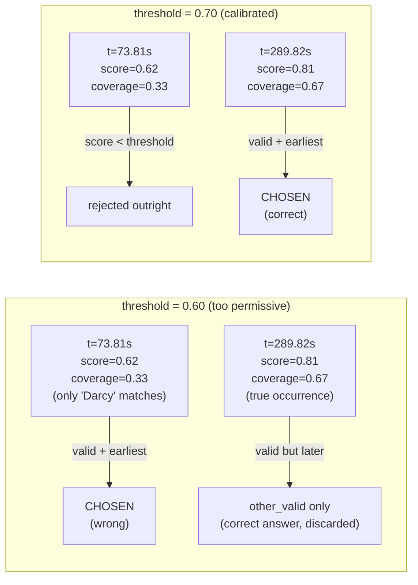

# Approach — Dialogue-to-Exact-Video-Frame Finder

This document explains the design, algorithms, assumptions, and trade-offs behind the
solution, and directly answers the evaluation questions from the Quest1 problem statement:

(3) how the solution determines where to look in the video, (4) how it determines the
relevant frame, (5) how it extracts the text, and (6) how ambiguous/uncertain results are
handled. LLM prompts (evaluation item 1) are recorded verbatim in `prompts.txt`.

## 1. Problem framing

The target dialogue is **spoken**, not necessarily displayed as on-screen text. The core
signal is therefore audio, not video/OCR. The primary problem is speech-to-video temporal
alignment: locate where in the audio the target phrase is spoken, refine that to a precise
onset, then map that onset to the video's own frame grid. No OCR or full-video visual
analysis is used anywhere in the pipeline.

## 2. End-to-end architecture

The system has two possible transcription paths:

1. **Caption-assisted path:** when caption assistance is enabled and usable captions are
   available, captions provide coarse localization only. Real ASR is then run on a small
   audio window around the candidate caption block and independently verifies the match.
2. **Full-video ASR path:** when captions are disabled, unavailable, unusable, or cannot
   be independently confirmed by local ASR, the system falls back to the original
   full-video ASR pipeline.

In both cases, once a trusted ASR transcript is available, the same indexed retrieval,
verification, onset refinement, and frame-mapping pipeline is used.

```text
URL + target dialogue
  -> MediaResolver                  (yt-dlp; provider-specific step)
  -> audio extraction               (PyAV, mono 16kHz)
  -> caption-assisted localization  (optional)
       -> coarse caption search
       -> local audio window
       -> real local ASR
       -> independent confirmation
  -> OR full-video ASR              (fallback)
  -> indexed retrieval              (inverted index, rarity-ranked anchors)
  -> local verification             (word alignment, lexical+coverage+contiguity)
  -> earliest-valid selection       (by TIME, never by score)
  -> [optional semantic fallback, only if lexical retrieval was weak/ambiguous]
  -> onset refinement               (first-target-word ASR timestamp, primary;
                                     bounded local audio refinement, secondary)
  -> PTS-aware frame mapping        (first decoded frame with PTS >= onset)
  -> frame extraction + save
  -> output contract                (Timestamp / Frame / Text / Image + confidence)
```

Everything after MediaResolver operates on a plain decoded media source and is identical
for every provider (see §3). Source modules: `src/dialogue_frame_finder/`.

Same pipeline, rendered as a diagram (GitHub renders this Mermaid block as an image):

```mermaid
flowchart TD
    A["URL + target dialogue"] --> B["MediaResolver
    (yt-dlp; provider-specific step)"]

    B --> C["Audio extraction
    (PyAV, mono 16kHz)"]

    C --> D{"Caption assist enabled?"}

    D -- "No" --> M["Full-video ASR
    (faster-whisper, base.en,
    word-level timestamps)"]

    D -- "Yes" --> E["Fetch coarse captions
    (manual preferred, auto-generated fallback)"]

    E --> F{"Usable captions found?"}

    F -- "No" --> M

    F -- "Yes" --> G["Coarse Transcript
    (block-level timestamps)"]

    G --> H["Coarse dialogue search
    (same search_dialogue)"]

    H --> I{"Valid coarse candidate?"}

    I -- "No" --> M

    I -- "Yes" --> J["Select candidates
    earliest-first
    (up to 3)"]

    J --> K["Build local audio window
    caption block span + padding
    capped at 60s"]

    K --> L["Local ASR
    (same faster-whisper ASRAdapter)"]

    L --> N["Search local ASR transcript
    (same search_dialogue)"]

    N --> O{"Confirmed valid match?"}

    O -- "Yes" --> P["Trusted local ASR transcript"]

    O -- "No" --> Q{"More coarse candidates?"}

    Q -- "Yes" --> J

    Q -- "No" --> M

    M --> R["Trusted full-video ASR transcript"]

    P --> S["Inverted index
    (word -> transcript positions)"]

    R --> S

    S --> T["Anchor selection
    (rarest words/n-grams
    in this transcript)"]

    T --> U["Indexed candidate retrieval
    (exact -> fuzzy -> bounded scan)"]

    U --> V["Local whole-phrase verification
    (word alignment:
    lexical + coverage + contiguity)"]

    V --> W{"score >= valid_score_threshold?"}

    W -- "No" --> X["Discard candidate"]

    X --> U

    W -- "Yes" --> Y["Add to valid_occurrences"]

    Y --> Z["Earliest-valid selection
    (sort by TIME, never by score)"]

    Z --> AA{"Confident lexical match?"}

    AA -- "No / ambiguous" --> AB["Optional semantic fallback (LLM)
    selects among existing candidates only
    never invents a timestamp"]

    AA -- "Yes" --> AC["Onset refinement
    ASR first-word timestamp = primary
    bounded local audio snap = secondary"]

    AB --> AC

    AC --> AD["PTS-aware frame mapping
    first decoded frame with
    PTS >= refined onset"]

    AD --> AE["Frame extraction + save"]

    AE --> AF["Output:
    Timestamp / Frame / Text / Image
    + confidence status"]
```



## 3. How the solution determines where to look in the video (evaluation item 3)

### Provider isolation

`media_resolver.py` is the *only* component that knows which platform a URL belongs to.
It resolves OK.ru/YouTube/other URLs to a plain local media file via yt-dlp, with
provider-specific quirks (found empirically, not assumed) isolated here only:

* OK.ru: the initial page fetch resets intermittently — retried with backoff (default 6
  attempts); its CDN's TLS chain isn't trusted by ffmpeg's bundled gnutls even though
  yt-dlp's own Python layer tolerates it — `-tls_verify 0` passed through to the ffmpeg
  downloader.

* YouTube: needs a JS runtime (Node) and, as of this build,
  `player_client=android,web_safari` extractor args to clear a bot-check without cookies.

Everything downstream — indexing, matching, onset refinement, frame mapping — takes no
provider-specific arguments at all (enforced by
`tests/unit/test_provider_independence.py`, a structural check that these functions cannot
even see which provider produced their input).

### Caption-assisted coarse localization

When caption assistance is enabled, captions are **not treated as the final timing source**.

The caption track is converted into a coarse, block-level `Transcript`. The target dialogue
is searched against this transcript using the same `search_dialogue()` used by the main
pipeline.

If a valid coarse candidate is found, its caption block span is used only to determine
which portion of the already-decoded audio should be transcribed. A padded local window is
created around the candidate's caption block and capped defensively.

The local window is then transcribed using the same `ASRAdapter` and `faster-whisper`
model used by the normal ASR path. The resulting local ASR transcript is searched again
using the same `search_dialogue()` and thresholding logic.

Only if the local ASR independently confirms a valid match is that local ASR transcript
trusted for the rest of the pipeline.

This means caption timestamps never determine the final onset or frame.

If captions are unavailable, unusable, fail to fetch, fail to produce a coarse candidate,
or no local-ASR candidate can be confirmed, the system falls back to the unchanged
full-video ASR path.

### Indexed candidate retrieval, not brute-force scanning

The trusted transcript (from full-video ASR or the caption-assisted local ASR path) is
built into a lightweight in-memory inverted index (`index.py`): a dict from normalized word
to the list of transcript positions where it occurs, plus a flat position-ordered word
array. This is *not* a database — it exists only in memory per run.

Rather than scanning the whole transcript for the target phrase, the target's own words
and short n-grams (up to trigrams) are ranked by how rare they are within this transcript
(`anchors.py`) — a word appearing once is a far better search anchor than one appearing
fifty times.

Retrieval (`retrieval.py`) tries the several rarest single words (not just the single
rarest anchor overall) plus the single most selective anchor overall, and unions their
index postings into candidate positions.

Trying multiple unigrams, not just the best one, matters in practice: if ASR corrupts a
different word in each occurrence of the target, the single most selective anchor (often a
rare n-gram) may exist in only one of them, silently hiding the rest — this was an actual
bug found and fixed during development
(`test_retrieve_candidates_recall_survives_different_word_corrupted_per_occurrence`).

### Fallback tiers

Escalated only when the previous tier finds nothing:

1. `exact_anchor` — the index lookup above.
2. `fuzzy_anchor` — approximate (edit-distance) vocabulary lookup, for when ASR corrupts
   the anchor word itself beyond exact matching (`fallback.py`).
3. `bounded_scan` — tiles the whole transcript into verification windows as a last resort,
   when no anchor (exact or fuzzy) exists anywhere.
4. `semantic_fallback` — optional, LLM-based, see §6 below.

Every result reports which tier actually produced it (`SearchResult.tier_used`) — never
silent.

### Local verification, not string equality

Index hits are candidate *locations*, not matches.

For each, a small neighborhood around it (`neighborhood.py`, target length plus a tolerance
margin, clipped to transcript bounds) is compared against the *entire* target phrase via
word-level alignment (`align.py`): a small dynamic-programming alignment with free
leading/trailing skips (filler words around the target cost nothing) but a real internal
gap penalty using **signed** match scores (`2*similarity - 1`), so a poor pairing actively
costs almost as much as a true gap.

Without this, two unrelated words could look "free" to align rather than being correctly
treated as a mismatch.

This is what makes word order matter without a separate "sequence similarity" metric: a
scrambled candidate cannot achieve a good monotonic alignment path.

`verification.py` turns that alignment into:

* lexical similarity
* coverage
* contiguity

These are combined into a weighted score. A window is valid only above the configurable
validity threshold.

### Earliest-valid selection — the target may occur more than once

All valid windows across the whole transcript are kept (`selection.py`), then sorted by
**video time**, not score, and the earliest wins.

A later, higher-scoring occurrence is retained only as diagnostic metadata
(`SearchResult.other_valid`), feeding the ambiguity check in §6 — it never overrides the
earliest-time choice.

Why the *threshold* matters just as much as the *selection rule*, illustrated with a real
case found during calibration (a YouTube video, target "Let's go Darcy"):



The selection rule ("earliest wins, never highest score") was correct from the start and
is exactly what a real-world case like a chorus/refrain needs — but it only produces the
right answer when the validity gate has already filtered out low-coverage coincidences.

This is why `valid_score_threshold` was recalibrated in §9 rather than changing the
selection rule itself.

## 4. How the solution determines the relevant frame (evaluation item 4)

### Onset

The ASR timestamp of the target's own first word is primary — not general speech onset.

The word-level alignment above identifies which transcript word matches the target's first
word specifically; that word's own ASR timestamp is the coarse onset.

This deliberately is *not* "where does speech begin nearby" — those are different
questions. If the target follows other dialogue with no pause, or starts while another
speaker is already talking, a naive VAD pass over the whole utterance would report the
wrong (earlier) instant.

### Bounded, directional local refinement (`onset.py`)

A short audio window — at most `onset_pre_roll` (0.15s default) before the ASR timestamp to
`onset_post_roll` (0.30s) after — is inspected for a genuine acoustic transition to snap
to, correcting ASR's typical late/rounded bias.

Two safeguards prevent this from becoming the "general VAD" mistake above:

* Energies are smoothed (3-tap moving average) before classification, since a real onset
  is a sustained multi-frame rise, not a single-frame blip.

* A hard gate requires the window's energy dynamic range to clear
  `onset_dynamic_range_ratio` (3x default) before any transition-hunting runs at all — a
  genuine silence/speech boundary swings energy by an order of magnitude; ordinary
  frame-to-frame variance within otherwise-uniform audio does not.

Without this gate, per-window min-max normalization alone would always find *some* frame
near the window's own minimum and misclassify it as "silence" relative to the window's own
maximum, even in continuous speech — a real bug caught by testing the exact continuous-
speech scenarios below, not a hypothetical.

If the window shows continuous speech throughout (no pause before the target, or another
speaker already talking) or no speech at all, refinement is a deliberate no-op: the ASR
timestamp is kept unchanged, with a diagnostic reason recorded
(`no_local_transition_continuous_speech` / `no_speech_detected`) rather than a guess.

Directly tested:
`test_refine_onset_target_follows_other_speech_with_no_pause` and
`test_refine_onset_target_starts_amid_already_ongoing_speech`.

### PTS-aware frame mapping, never `timestamp * FPS`

`frame_mapping.py` decodes the video (PyAV) and selects the **first decoded frame whose
actual presentation timestamp (PTS) is >= the refined onset** — the operational definition
of "first frame."

This is necessary, not a nicety: the Phase 0 feasibility spike found real inter-frame PTS
gaps in the actual supplied OK.ru source that are not perfectly uniform even at a nominal
23.98fps, and a dedicated test fixture exercises a genuinely irregular (VFR-like) PTS
sequence to confirm selection is PTS-driven, not FPS-arithmetic.

By default this decodes from the start of the video up to the target instant to obtain an
exact frame number (OUT-02, "frame number where applicable") — a real, one-time cost
proportional to how far into the video the match falls, not the file's total length, and
bounded because it only runs once, after the target instant is already known from every
prior stage.

A caller processing very long sources with very late targets can inject a different
`locate_frame_fn` (e.g. the efficient keyframe-seek mode, which reports no frame number)
if that cost becomes an issue — the pipeline's dependency-injection points exist exactly
for this.

Video-less (audio-only) media raises a clear `ValueError` rather than an opaque `IndexError`
— a small but deliberate compliance fix (test-plan.docx's negative-test requirement that
failures be explicit, not silent).

## 5. How the solution extracts the text (evaluation item 5)

Word-level ASR (faster-whisper, see §8 for the model choice) produces the transcript that
both indexing (§3) and onset extraction (§4) operate on.

The reported `Text` field is the **actual transcribed words** spanning the matched region
(`output.py: extract_matched_text`) — i.e. what the system actually heard and matched
against, in original casing, not the target text echoed back.

This is deliberate: on the real supplied OK.ru example, ASR mis-heard "rebels at" as
"reveals its," and the reported Text correctly shows "My mind reveals its stagnation." —
letting an evaluator see exactly what evidence the match is based on, rather than silently
substituting the target phrase back into the output.

## 6. How ambiguous or uncertain results are handled (evaluation item 6)

Status classification (`output.py: classify_confidence`) is checked in a specific order and
is deliberately independent of *which* occurrence gets selected (§3's earliest-time rule
always applies first):

1. `NO_CONFIDENT_MATCH` — no valid occurrence found by any retrieval tier. All four output
   fields are `None` rather than a fabricated placeholder.

2. `AMBIGUOUS_MATCH` — checked next, and can override an otherwise-high score: if the best
   other valid occurrence's score is within `ambiguity_score_margin` (0.05 default) of the
   chosen (earliest) one's score, that's flagged explicitly.

   This directly implements the "same phrase occurs twice" case (test-plan.docx TM-07:
   "return strongest candidate or `AMBIGUOUS_MATCH` when scores are too close") without
   reopening the earliest-time selection rule — ambiguity is reported *alongside* the
   earliest choice, never used to swap it for a different one.

3. `HIGH_CONFIDENCE` / `MEDIUM_CONFIDENCE` / `LOW_CONFIDENCE` — absolute score bands
   (0.80 / 0.75 defaults) otherwise. Calibration rationale in §9.

Confidence and diagnostic fields (`OutputRecord.confidence_score`, `.diagnostics`) are
supplementary to the four required fields, never a substitute — per requirements.docx
OUT-06, "supplementary."

### Optional LLM semantic fallback

`semantic.py` is consulted *only* when the lexical/fuzzy pipeline produces
`NO_CONFIDENT_MATCH` or an ambiguous result — never when a confident lexical match already
exists.

It selects among candidate windows already located by the same `bounded_scan_windows` used
by the lexical fallback tier — it is never asked for, and structurally cannot supply, a
timestamp or frame number:

* The model is offered candidates by an opaque, code-generated id (`c0`, `c1`, ...), not a
  timestamp or transcript excerpt — nothing timestamp-shaped for it to hallucinate a
  variant of.

* If its answer names an id that was never actually offered, the answer is rejected
  outright (`parse_semantic_response`), not just discouraged by prompt wording.

* On a confident pick, the actual onset still comes from re-running the same
  `verify_window` word-alignment used by the lexical path on the selected window — the LLM
  never contributes a time value itself, only a selection.

* The exact prompt template is recorded in `prompts.txt`, per the Submission Process
  Flowchart requirement.

## 7. Efficiency (with real, measured profiling — added 2026-08-26)

For a long video, the design deliberately avoids expensive frame-by-frame visual analysis
across the whole file: ASR runs once in the normal path, retrieval narrows to a handful of
candidate windows via the index (§3), and audio/frame-level work only happens in small
neighborhoods around those candidates.

The caption-assisted path additionally avoids full-video ASR when captions can successfully
localize and a short local ASR pass can independently confirm the target.

The one exception, PTS-aware frame extraction's default exact-numbering mode (§4), is
bounded by construction: it runs once, after every prior stage has already narrowed the
target down to a single instant.

### Real per-stage measurements

These are not estimates — they were obtained through targeted timers around the actual
production functions, without changing production logic, using the same real approximately
7-minute YouTube video for a controlled comparison.

| Stage                                           | No captions (full-video ASR) |  Captions available |
| ------------------------------------------------ | ----------------------------: | -------------------: |
| Total wall-clock                                 |                    **86.17s** |           **32.88s** |
| ASR transcription                                |           60.975s — **70.8%** |   3.426s — **10.4%** |
| Video download                                   |               16.815s — 19.5% |  16.653s — **50.6%** |
| Frame extraction                                 |                 7.190s — 8.3% |   7.349s — **22.3%** |
| Caption fetch                                    |                              — |   4.264s — **13.0%** |
| Indexing + retrieval + verification + selection  |           **0.006s — 0.007%** |       0.007s — 0.02% |

The caption-assisted ASR value above represents three local-ASR attempts in that particular
run.

This confirms, with evidence rather than assumption, that **ASR is the dominant cost** when
no caption track is used: 70.8% of total time in one full-video transcription call.

Indexed retrieval and fuzzy verification are categorically not a bottleneck in the measured
runs — roughly 10,000x cheaper than ASR.

Once full-video ASR is avoided through captions, the bottleneck relocates: video download
becomes the largest single stage, with frame extraction close behind.

Frame extraction's cost is a separate finding: it scales with how far into the video the
match falls (§4's decode-from-start cost), not directly with total video length.

These numbers come from one real controlled A/B run on one video. They are therefore not
universal constants. The load-bearing finding is the relative behavior: ASR dominates
without captions, while download/frame extraction become more important once ASR is reduced.

## 8. ASR model choice

**Current default: faster-whisper `base.en`**, with VAD filtering enabled
(`vad_filter=True`).

VAD filtering is not just an accuracy nicety here: without it, faster-whisper's feature
extractor builds one array covering the entire audio at once, which is memory-prohibitive
for a long source — this exhausted available RAM on the real 54-minute OK.ru video during
validation.

VAD filtering (skip silence, chunk by detected speech) fixed this and is also a genuine
accuracy improvement independent of the memory issue.

### Historical evidence: tiny.en vs. base.en

A controlled comparison using the same 60-second real audio neighborhood around the actual
target occurrence found that `base.en` cost 3.3x the runtime and approximately 17% more peak
memory than `tiny.en`, improved transcription of unrelated words elsewhere in the passage,
but made the **identical** error on the target phrase itself ("reveals its stagnation"
instead of "rebels at stagnation").

Given the later interview/demo requirements and the overall accuracy/latency trade-off,
the current default was set to `base.en`.

`FasterWhisperASR(model_size=...)` keeps the model choice configurable without changing the
architecture.

Critically, localization was unaffected either way in the measured comparison — both
transcripts, fed through the same unmodified `search_dialogue`, produced the identical match
(score 0.8135, same tier, same validity).

### Model selection

Model selection is currently exposed via the **web UI/API only**, not the CLI.

The web UI's Advanced section and `/api/search` request body accept an `asr_model` field,
constructing `FasterWhisperASR(model_size=...)` per request.

The CLI has no equivalent `--asr-model` flag today.

## 9. Threshold calibration

Per test-plan.docx's explicit instruction not to hardcode arbitrary universal tolerances
before measuring real behavior, defaults in `config.py`'s `SearchConfig` were validated
against evidence from two independent sources, not chosen a priori:

* The full synthetic unit-test suite (TM-01..09, FR-01..07 style cases): exact matches
  score 1.0; a single-word ASR substitution scores approximately 0.8 and remains valid;
  scrambled word order scores approximately 0.4 and is correctly rejected.

* Two real end-to-end runs (OK.ru: 2 of 5 target words ASR-corrupted, scored 0.8135,
  correctly landed in `MEDIUM_CONFIDENCE`; YouTube/Apollo 11: 1 of 5 words corrupted,
  scored 0.879, correctly landed in `HIGH_CONFIDENCE`) confirm that the confidence bands grade
  realistic ASR corruption sensibly.

### Update: `valid_score_threshold` raised from 0.60 to 0.70

A real failure case (a YouTube video, target "Let's go Darcy") showed spurious short-phrase
matches scoring up to 0.6212 — high enough to pass the old 0.60 threshold and, via the
earliest-valid-wins rule, beat the true match later in the video.

The true occurrence scored 0.8093.

Investigation against the full offline regression suite, two real E2E cases, and the cached
Darcy transcript found a clean gap between known false positives (≤0.6212) and known true
positives (≥0.80).

0.70 therefore clears every known false positive with margin while preserving every known
true positive with headroom.

### Update: `confidence_high_threshold` lowered from 0.85 to 0.80

Known false positives cap at 0.62, well clear of 0.80.

Real single-word-ASR-error matches scoring approximately 0.81–0.83 were previously capped at
`MEDIUM_CONFIDENCE`; lowering the high-confidence threshold to 0.80 allows these genuinely
strong matches to be reported as `HIGH_CONFIDENCE`.

### Update: `confidence_medium_threshold` raised from 0.65 to 0.75

Since `valid_score_threshold` is now 0.70, the old 0.65 medium threshold sat below the
validity threshold, making `LOW_CONFIDENCE` unreachable through the real pipeline.

The current bands are:

```text
[0.70, 0.75) -> LOW_CONFIDENCE
[0.75, 0.80) -> MEDIUM_CONFIDENCE
[0.80, 1.00] -> HIGH_CONFIDENCE
```

## 10. Caption-assisted local ASR (optional latency optimization, added 2026-08-26)

Full-video ASR is the dominant cost for long sources.

`captions.py` adds an **opt-in** (`--use-captions` / `caption_source=` parameter,
`None`/off by default) fast path.

When a usable caption/subtitle track exists, captions are used to coarsely locate a region.
Real ASR then runs only on a short local audio window instead of the entire video.

The captions themselves are **never used as the final timestamp source**.

```mermaid
flowchart TD

    A["--use-captions passed?"]
        -- "no (default)" -->
    Z["Full-video ASR
    (unchanged path, see §2)"]

    A -- "yes" --> B["CaptionSource.fetch_coarse_transcript(url)"]

    B -- "no usable track
    (none found / wrong language / fetch failed)" --> Z

    B -- "block-level Transcript" --> C[
        "search_dialogue on COARSE transcript
        (same unmodified function as §3)"
    ]

    C -- "no confident coarse match" --> Z

    C -- "candidate(s)" --> D[
        "For each coarse candidate,
        earliest-first, up to
        caption_max_coarse_candidates"
    ]

    D --> E[
        "compute_local_window
        (candidate block span + padding, capped)"
    ]

    E --> F[
        "slice already-decoded full-video audio
        to that window -> temp WAV"
    ]

    F --> G[
        "asr_adapter.transcribe(temp_wav)
        (same ASRAdapter, same model)"
    ]

    G --> H[
        "search_dialogue on LOCAL transcript
        (independent re-verification)"
    ]

    H -- "confirmed" --> I[
        "Use local ASR transcript
        transcript_source = captions_local_asr"
    ]

    H -- "not confirmed" --> D

    D -- "cap exhausted, none confirmed" --> Z

    I --> J[
        "Continue unchanged:
        index -> retrieval -> verification ->
        earliest-valid -> onset -> PTS frame mapping -> output"
    ]

    Z --> J
```

### Why captions are never trusted for final timing

Real investigation on the actual videos used in this project found that YouTube auto-caption
word-level offsets (`tOffsetMs` in the `json3` format) were absent for both tested videos.

Every word therefore effectively inherited its caption block's start time.

Naively trusting those block starts as exact onset times produced errors of approximately
9.3 seconds and 2.1 seconds in the two measured cases — far outside the bounded onset-
refinement window tuned for faster-whisper's own characterized timestamp behavior.

Therefore captions are used for exactly one purpose:

**identifying which several-second region plausibly contains the target.**

They are not trusted for final word timing, onset calculation, or frame mapping.

### Mechanism

`CaptionSource.fetch_coarse_transcript` builds a block-level `Transcript` from the available
caption track.

`compute_local_window` pads the matched candidate's own block span and caps it defensively.

`transcribe_local_window` slices the already-decoded full-video audio to that window, writes
it to a small temporary WAV, and calls the exact same injected
`ASRAdapter.transcribe(path)` used by the full-video path.

The local ASR result is independently re-verified through `search_dialogue` before being
trusted.

If it is not confirmed, the next-earliest coarse candidate is tried, up to
`caption_max_coarse_candidates`.

If none confirm, the pipeline falls through to the exact full-video ASR path used when the
feature is disabled.

`search_dialogue`, `verification.py`, `onset.py`, and `frame_mapping.py` are not changed by
the caption feature.

### Real measured results

Initial E2E validation on a real approximately 7-minute YouTube video measured:

* Caption-assisted path: **43–51s**
* Equivalent full-video `base.en` path: **239–341s**
* Approximately **5–7x** speedup in those runs.

A later controlled A/B profiling run on the same video measured:

* Full-video path: **86.17s**
* Caption-assisted path: **32.88s**
* Approximately **2.62x** speedup.

Both measurements are real.

The difference reflects run-to-run variation, particularly the number of coarse candidates
that needed local-ASR confirmation.

The caption-assisted path does not guarantee improved accuracy. It preserves the underlying
ASR model's accuracy characteristics while reducing the amount of audio that needs to be
transcribed.

A genuine limitation found during validation is that local-ASR confirmation establishes
that a valid match exists in a candidate window, but does not mathematically guarantee that
the candidate is uniquely the correct occurrence if multiple coincidental matches exist.

The feature is therefore opt-in and falls back to the original full-video ASR path whenever
captions are unavailable or local confirmation fails.

### Testing

`tests/unit/test_captions.py` covers caption track selection, language matching,
fetch-failure handling, window padding/clipping/capping, and caption parsing.

`tests/unit/test_pipeline.py` covers caption-assisted orchestration including:

* successful caption-assisted localization
* no-caption fallback
* no-coarse-match fallback
* local-ASR-not-confirming fallback
* multi-candidate recovery

All default tests use fakes and do not require real network access.

## 11. Web UI / API

A browser-based alternative to the CLI was built as a **thin wrapper around the existing
pipeline, not a reimplementation**.

`src/dialogue_frame_finder/api.py` calls `run_pipeline` exactly as the CLI does.

No matching, verification, ASR, onset, or frame-mapping logic is duplicated between the two
entry points.

### Progress reporting

The one change made to core pipeline code for the web UI is additive-only:

`run_pipeline` and `try_caption_assisted_transcript` accept an optional:

```python
on_stage: Callable[[str], None] = None
```

parameter.

The callback is invoked at real stage boundaries such as:

* downloading video
* transcribing audio
* verifying dialogue
* locating exact frame

It defaults to a no-op, so existing callers remain unaffected.

This lets the web UI display genuine progress stages without fabricating a percentage that
the backend cannot accurately calculate.

### Backend architecture

The web API uses FastAPI.

There is:

* no task queue
* no database
* no WebSocket requirement

Each search runs in a background thread.

Job state is stored in an in-memory dictionary:

```text
job_id -> {
    stage,
    status,
    result,
    error
}
```

The browser polls:

```text
GET /api/search/{job_id}
```

approximately every 1.2 seconds until the job leaves `"running"`.

This is deliberately the smallest architecture that satisfies the requirements for a
single-user local tool.

### Frontend

The frontend is vanilla HTML/CSS/JavaScript under `web/`.

There is no build step and no Node/npm frontend toolchain.

The same FastAPI process serves the static frontend.

The browser:

1. submits a search through `POST /api/search`
2. receives a `job_id`
3. polls the job endpoint
4. displays stage progress
5. displays the final output
6. retrieves the extracted image through:

```text
GET /api/search/{job_id}/image
```

The image is the same frame file produced by the existing pipeline.

### Error handling

`NO_CONFIDENT_MATCH`, `AMBIGUOUS_MATCH`, and `LOW_CONFIDENCE` are rendered as legitimate
results rather than application errors.

Actual failures such as `MediaResolutionError` are mapped to human-readable messages.

Raw tracebacks are not returned to the browser.

### Testing

`tests/unit/test_api.py` uses FastAPI's `TestClient` with a fake `run_pipeline` injected via
`monkeypatch`, keeping the API tests offline and consistent with the rest of the suite's
dependency-injection discipline.

The complete chain was also verified with:

* a live `uvicorn` server
* a real HTTP `POST /api/search`
* real progress polling
* the extracted image served through the API
* visual confirmation of the returned frame

### CLI remains supported

The CLI remains fully supported alongside the web UI.

Both interfaces call the same `run_pipeline()` implementation, so the underlying search,
verification, onset, and frame extraction behavior does not diverge between interfaces.

## 12. Known limitations and assumptions

* ASR accuracy is inherently model- and audio-quality-dependent; the system is designed to
  *tolerate* ASR error, not eliminate it.

* `MediaResolver`'s YouTube bot-check workaround
  (`player_client=android,web_safari`) is a currently-effective mitigation for an evolving
  external dependency. It may require updating if YouTube changes its detection behavior.

* Exact frame numbering's decode-from-start cost (§4) scales with how far into a video the
  target falls. A caller with a very long source and a very late target can inject a different
  `locate_frame_fn` if this cost becomes important.

* Semantic fallback (§6) requires network access and an Anthropic API key. It is optional and
  the pipeline works fully without it.

* Caption-assisted local ASR (§10) is opt-in and, on hard content, is only as accurate as the
  underlying ASR model. It is primarily a latency optimization rather than an accuracy
  improvement.

* ASR model selection is currently exposed through the web UI/API only, not the CLI.

### Investigated but deliberately deferred optimizations

The following were evaluated conceptually and/or through targeted experiments but are **not
implemented**:

* downloading audio and video concurrently rather than relying on the current single muxed
  download;
* fast/small-model coarse ASR with early stopping for caption-less sources;
* chunked/streaming ASR;
* a two-stage `tiny.en` → `base.en` design without early stopping.

These were deliberately deferred because they require additional experiments to establish
whether the latency gain is real while preserving the project's earliest-valid-occurrence
correctness requirement.

The current evidence shows that indexing, retrieval, and verification are not the primary
latency bottleneck. ASR is the dominant cost when captions are unavailable, while download
and frame extraction become more important once caption-assisted local ASR removes most of
the full-video ASR cost.

## 13. Repository structure

```text
src/dialogue_frame_finder/   complete source
                              includes api.py for the web UI backend

web/                          static frontend
                              index.html, style.css, app.js

tests/unit/                   pure-logic tests, no network/media
                              pytest -m unit

tests/integration/            real local audio/video fixtures
                              no network

tests/e2e/                    real network + real ASR
                              opt-in only

tests/video_fixtures.py       synthetic media generators shared by tests

outputs/images/               runtime output location
                              generated per run

README.md                     setup, usage, examples

APPROACH.md                   this document

prompts.txt                   LLM prompts that materially influence
                              the solution

requirements.txt              core pipeline/CLI dependencies

requirements-web.txt          additional web UI dependencies
                              FastAPI, Uvicorn

pyproject.toml                project and pytest configuration
```

Current test count: **235 passing**.

Two E2E tests are deselected by default and can be run explicitly with:

```bash
pytest -m e2e
```
